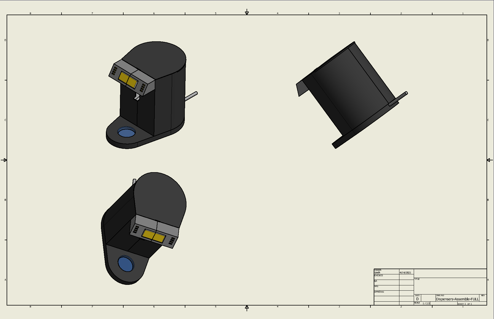
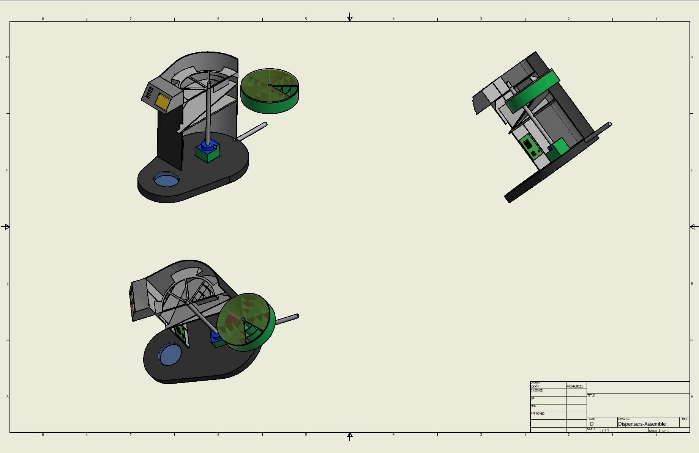
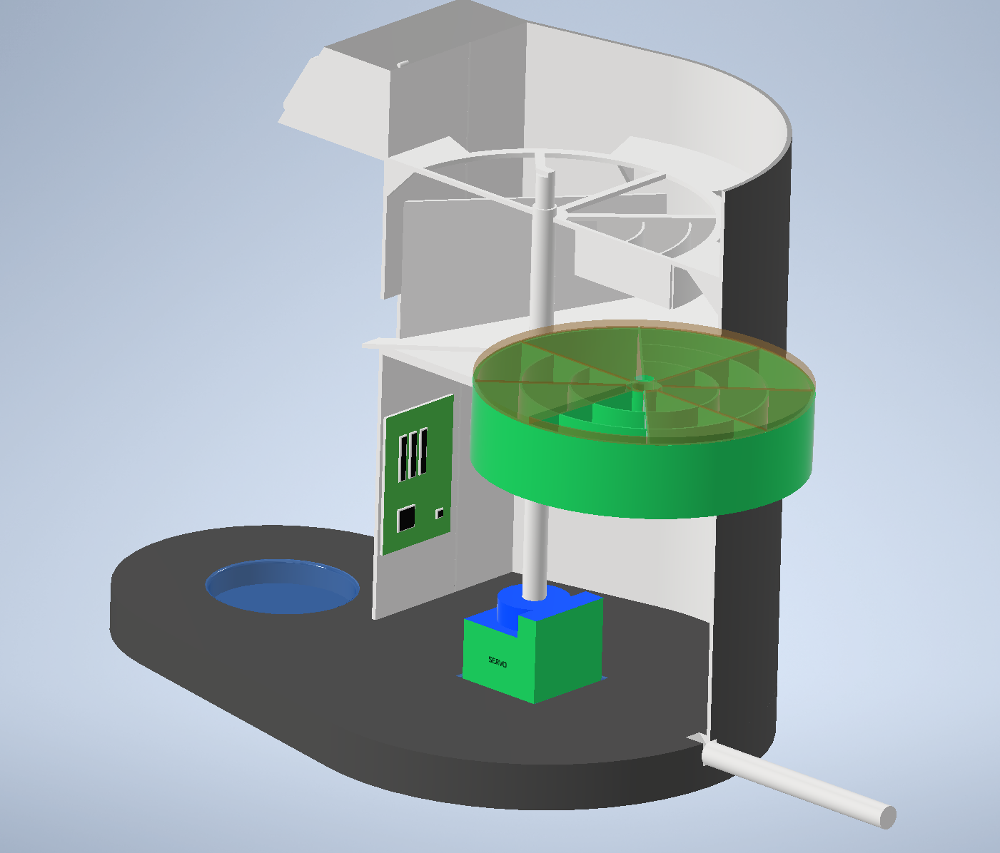
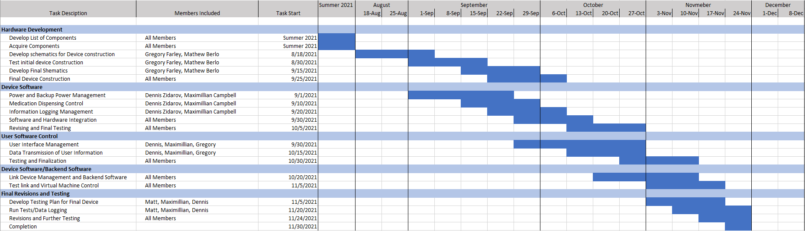

<!DOCTYPE html>
<html lang="en">
   <head>
      <h1>MedMag</h1>
      
      
Medicine Magazine (MedMag) is the product of the senior design project of Matthew Berlo, Maximillian Campbell, Gregory Farley and Dennis Zidarov. The goal of the MedMag was to enable independent living for the elderly and mentally disabled by giving them peace of mind in regards to their medication management. The MedMag project was designed and implemented from January 2021 to December 2021.

	   
For a quick summary, check out our <a href="assets/Final Brochure.pdf">Brochure</a>!

      <h1>Table of Contents</h1>
      <ul>
         <li><a href="mission">Mission Statement</a></li>
         <li><a href="management">Project Management</a></li>
         <li><a href="technologies">Technologies</a></li>
         <ul>
		 <li><a href="hardesign">Hardware Design</a></li>
		 <li><a href="hardspecs">Hardware Specifications</a></li>
		 <li><a href="softspecs">Software</a></li>
         </ul>
      	 <li><a href="conc">Conclusion</a></li>
      </ul>
   </head>
   <body>
      <h1><a id="mission">Mission Statement</a></h1>
      
<b>To design and build an automatic medication dispenser and allow elderly, mentally disabled and mentally ill to take medication at appropriate times, without the risk of missing medication intake times or double dosing.</b>

      
In the United States many people take prescription medications, particularly the elderly population. In the 50-64 age group the average individual has 13 annually filled prescriptions, those aged 65-79 have on average 20 yearly prescriptions, and those 80+ have 22. This indicates that the device should have the capacity to store and dispense at minimum 20 distinct medications.

      
Extensive background research has been done from small $20 devices with minimum functionality to $1,500 devices that act as smart devices by interacting in the home. Medication Dispensing Devices need to be intuitive and easy to use for both the patient and the caregiver, allowing for scheduled dispensation of medication. In addition to being intuitive the device needs to have a storage capacity capable of storing approximately 2 weeks worth of medication for the average user.

      <h1><a id="management">Project Management</a></h1>
      <ul>
         <li>Mattew Berlo</li>
         <ul>
            <li>Hardware Designer</li>
            <li>Hardware and Software Tester</li>
            <li>Lead Tester</li>
            <li>Schedule Manager</li>
         </ul>
         <li>Maximillian Campbell</li>
         <ul>
            <li>Software Designer</li>
            <li>Software Tester</li>
            <li>Lead Software Engineer</li>
	    <li>Software Security Engineer</li>
         </ul>
         <li>Hunter Farley</li>
         <ul>
            <li>Hardware Designer</li>
            <li>Lead Hardware Engineer</li>
            <li>Lead Public Relationship</li>
         </ul>
         <li>Dennis Zidarov</li>
         <ul>
            <li>Software Engineer</li>
            <li>Project Manager</li>
            <li>Software and Hardware Tester</li>
         </ul>
      </ul>
      <h1><a id="tech">Technologies</a></h1>
	   <h2><a id="hardesign">Hardware Design</a></h2>
	   
	   
Figure 1: Hardware Diagram representing the physical appearance of the medication dispenser and Medication Storage Unit.

	   
	   
Figure 2:  Hardware Diagram representing locations of components within the medication dispenser.

	   
	   
Figure 3: Close up detailed image of Dispenser and MedMag next to it.

	   <h2><a id="hardspecs">Hardware Specification</a></h2>
	   MedMag is ran entirely on a <a href="https://www.raspberrypi.com/products/raspberry-pi-4-model-b/">Raspberry Pi 4</a>. The specifications of the Raspberry Pi 4 can be found <a href="https://www.raspberrypi.com/products/raspberry-pi-4-model-b/specifications/">here</a>. Note that we purchased a Raspberry Pi 4 with 4 GB of RAM.
	   <h2><a id="softspecs">Software</a></h2>
	   
The MedMag team implemented a Linux, Apache, MySQL, PHP (LAMP) stack for our web application. Some features of the web applications are as follows:

	   <ul>
		   <li>Several users/caregiver accounts</li>
		   <li>Feature seperation between users and caregivers</li>
		   <li>Medication dispersal history</li>
		   <li>Add/remove/modify medication dispersal times</li>
		   <li>Report generation in several formats (.pdf,.xml,.txt)</li>
	   </ul>
	   
The backend application, <a href="raspberry-pi/m3dicin3.py">m3dicin3.py</a>, was written in Python. This program acts as the backbone for the MedMag as it pulls information from the database and alerts the user when it is time to take their medication. m3dicin3.py is also responsible for handling interrupts and user interactions.

	   <h1><a id="conc">Conclusion</a></h1>
	   
Our medication dispenser is an easy to use, cost effective solution to the problem of getting medication to those in need of assistance. Our design allows for easy medication refills and easy dispensing. In addition remote monitoring tools provide the caregiver with updates as to patient usage allowing for peace of mind.

	   
	   
Figure 4: Final Gantt Chart

   </body>
</html>

